# Zona Dron

[English](README.md) · **Español**

[](https://github.com/DKNS-JCC/zonadron/releases/latest)
[](https://github.com/DKNS-JCC/zonadron/releases/latest)

¿Puedo volar el dron aquí? Zona Dron responde a esa pregunta en cualquier punto
de España, con las Zonas Geográficas UAS que publica ENAIRE. Señalas un sitio
—con el GPS, en el mapa, por dirección o por coordenadas— y te da una de estas
cinco respuestas:

- Puedes volar.
- Puedes volar con condiciones.
- Necesitas autorización.
- No puedes volar.
- No se ha podido comprobar.

Funciona en **Android** y en **iPhone/iPad**, en **español o en inglés**. Sin
cuenta, sin anuncios, sin seguimiento y sin claves de API.

> Esta aplicación es independiente de ENAIRE y no sustituye a la información
> oficial ni a la normativa aplicable. El piloto es el responsable del vuelo.

<p align="center">
  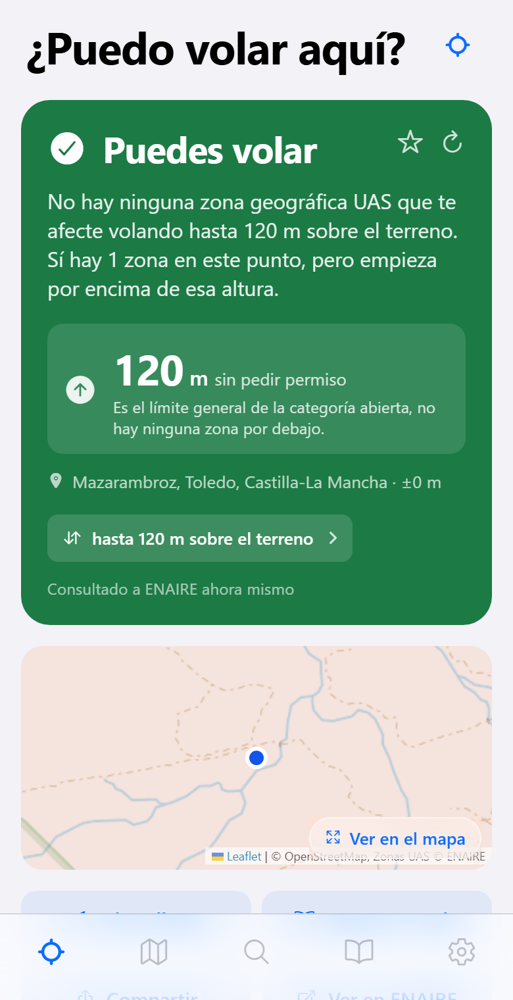
  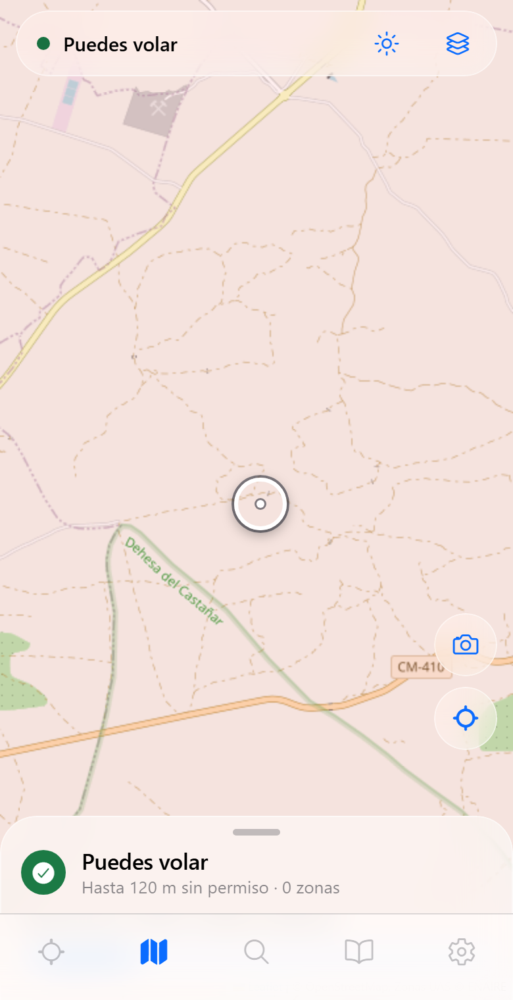
  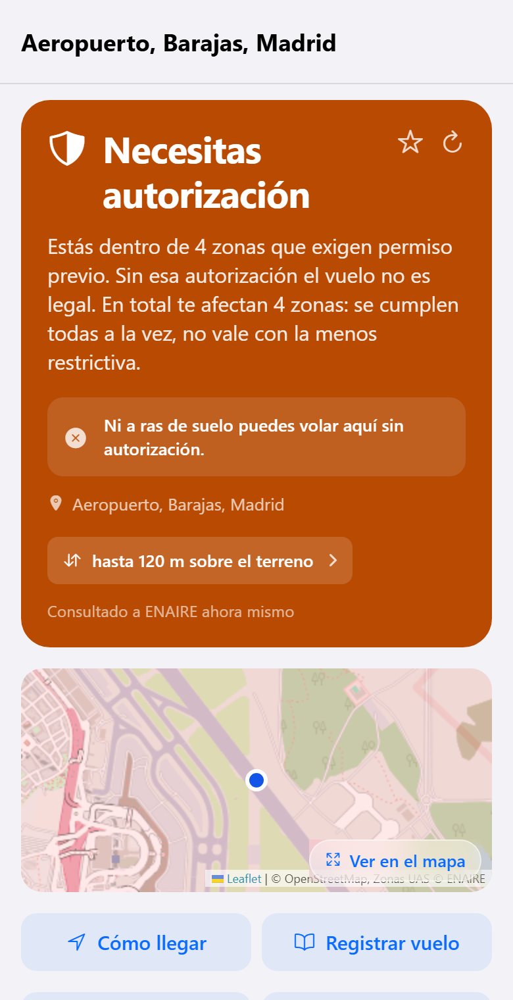
</p>

---

## Instalarla en el móvil

### iPhone o iPad — paso a paso

Zona Dron **no está en la App Store**: publicar allí cuesta 99 €/año y esto es
un proyecto libre. En su lugar, cada versión incluye un **`.ipa` sin firmar**
que instalas tú con un Apple ID gratuito. Apple lo llama *firma de desarrollo
personal*, funciona en cualquier iPhone, no hace falta jailbreak y no te van a
bloquear la cuenta por hacerlo.

Hay una pega, y es una regla de Apple, no nuestra: **una app firmada con un
Apple ID gratuito deja de funcionar a los 7 días** y hay que volver a firmarla.
El método B de abajo se encarga solo de esa renovación.

**Antes de empezar necesitas:**

- Un iPhone o iPad con **iOS 16.4 o posterior**.
- Un PC con Windows o un Mac, y el **cable USB** del móvil.
- Un **Apple ID**. Vale cualquiera. Si prefieres no meter el tuyo de siempre en
  una herramienta de terceros, [crea un segundo Apple ID gratuito](https://account.apple.com/)
  y usa ese: la app funcionará exactamente igual.
- El archivo `ZonaDron-x.y.z-unsigned.ipa`, de la
  [última versión](https://github.com/DKNS-JCC/zonadron/releases/latest).
  Descárgalo sólo desde ahí.

#### Método A — Sideloadly (lo más sencillo, se hace una vez)

Mejor si sólo quieres tener la app ya y no te importa repetir cinco minutos de
trabajo cada semana.

1. **Sólo en Windows:** instala **iTunes desde
   [apple.com](https://www.apple.com/es/itunes/download/)** —*no* la versión de
   la Microsoft Store—. Sideloadly necesita los controladores que vienen con
   ella. En Mac sáltate este paso.
2. Descarga e instala **[Sideloadly](https://sideloadly.io/)**.
3. Conecta el iPhone al ordenador con el cable, desbloquea la pantalla y pulsa
   **Confiar** cuando el móvil pregunte si confías en este ordenador.
4. Abre Sideloadly. El móvil debería aparecer arriba, en **iDevice**.
5. Arrastra `ZonaDron-x.y.z-unsigned.ipa` a la ventana de Sideloadly.
6. Escribe tu Apple ID en la casilla **Apple account** y pulsa **Start**.
   Sideloadly te pedirá la contraseña del Apple ID y después el código de seis
   dígitos que aparece en el iPhone. Es el inicio de sesión normal de Apple: la
   contraseña va a Apple, no a nosotros.
7. Espera a que diga **Done**. Zona Dron ya está en la pantalla de inicio, pero
   todavía no abre.
8. En el iPhone entra en **Ajustes → General → VPN y gestión de dispositivos**,
   toca tu Apple ID debajo de *App de desarrollador* y pulsa **Confiar**.
9. Abre Zona Dron. Cuando te pida la ubicación, elige **Al usar la app**: sin
   eso, la pestaña «Volar aquí» no sabe dónde estás.

**Cada 7 días** la app dejará de abrirse. Repite los pasos 3–7 (puedes instalar
encima; tus sitios guardados y tu diario de vuelos se mantienen). El paso 8 no
hace falta repetirlo.

#### Método B — AltStore o SideStore (se renueva solo)

Mejor si quieres olvidarte del límite de los 7 días.

1. Instala **[AltStore Classic](https://altstore.io/)** siguiendo las
   instrucciones de su web: instalas *AltServer* en el PC o el Mac, conectas el
   móvil una vez y AltServer se empareja con él.
2. Abre **AltStore** en el móvil → **My Apps** → **+** → elige el archivo
   `ZonaDron-x.y.z-unsigned.ipa` que descargaste.
3. Confía en el certificado como en el paso 8 de arriba, si el móvil lo pide.
4. Deja el ordenador encendido y en la misma wifi. AltStore vuelve a firmar la
   app en segundo plano antes de que pasen los 7 días, y la app no deja de
   funcionar nunca.

[**SideStore**](https://sidestore.io/) hace lo mismo sin necesidad de que el
ordenador esté encendido, a cambio de una instalación algo más larga.

#### Conviene saber

- Un Apple ID gratuito admite **tres** apps instaladas así a la vez, y unos diez
  identificadores nuevos por semana. Si la instalación falla por límite, quita
  otra app instalada por sideload y vuelve a intentarlo.
- Zona Dron pide **un** permiso: la ubicación, y sólo mientras la app está
  abierta. No lleva analítica ni cuentas, y los datos de operador que escribes
  en Ajustes no salen del móvil.
- Si ya tienes un Mac con Xcode, puedes saltarte todo esto e instalarla
  directamente desde el código — mira [Compilarla tú mismo](#compilarla-tú-mismo).

### Android

Descarga el `.apk` de la
[última versión](https://github.com/DKNS-JCC/zonadron/releases/latest) y ábrelo
en el móvil. Android pedirá permiso para instalar aplicaciones de origen
externo: dáselo al navegador o al gestor de archivos y confirma.

---

## Cómo se usa

Cinco pestañas, y todo lo demás cuelga de ellas.

<table>
<tr>
<td width="33%"></td>
<td width="33%"></td>
<td width="33%">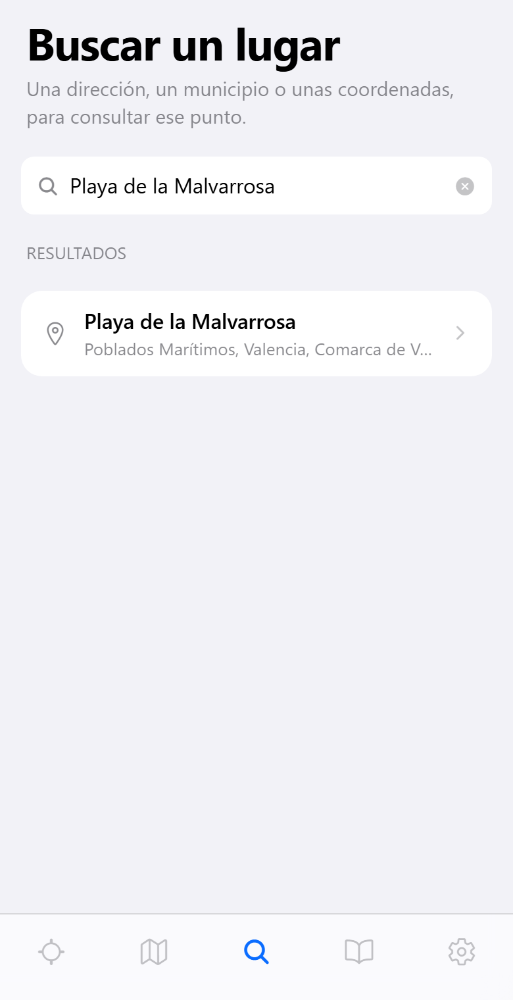</td>
</tr>
<tr>
<td align="center"><b>Volar aquí</b></td>
<td align="center"><b>Mapa</b></td>
<td align="center"><b>Buscar</b></td>
</tr>
</table>

### Volar aquí

Arranca en tu posición GPS y responde de inmediato. La tarjeta de color es el
veredicto; debajo tienes la **altura máxima que puedes usar sin pedirle permiso
a nadie**, el nombre del sitio y la altura con la que se está comparando.

Toca **hasta 120 m sobre el terreno** para cambiar esa altura: el veredicto se
recalcula, porque una zona que te bloquea a 120 m muchas veces no existe a 30 m.
Todo lo que hay bajo la tarjeta es detalle opcional — el minimapa, cómo llegar,
compartir, el visor oficial de ENAIRE, la previsión de luz y sombras, las zonas
que te afectan, los NOTAM, si estás en entorno urbano y los espacios naturales
protegidos.

La estrella guarda el sitio en el cuaderno; la flecha circular vuelve a
preguntar a ENAIRE.

### Mapa

Arrastra el mapa: lo que se consulta es la mirilla del centro, y la barra de
abajo se actualiza con el veredicto de lo que tenga debajo. Tira de esa barra
hacia arriba para ver el resultado completo.

- El botón de **capas** cambia entre OpenStreetMap, el mapa topográfico del IGN
  y la ortofoto del PNOA, y enciende la capa de altura disponible cuando tienes
  una zona descargada.
- El botón del **sol** dibuja la trayectoria solar sobre el mapa.
- El botón de la **cámara** es el planificador de fotos: dices qué quieres
  fotografiar y te propone puntos desde los que puedes volar con vistas a eso.
- El botón de la **mirilla** te vuelve a centrar en tu posición.

### Buscar

Escribe una dirección, un municipio, un sitio conocido —o pega unas coordenadas
como `39.47, -0.32`— y consulta un punto sin ir hasta allí. Útil la noche antes.

### Compartir una chincheta desde Maps

Abre el sitio en **Google Maps** o en **Apple Maps**, dale a compartir y elige
Zona Dron: la app abre el mapa con la mirilla en ese punto y lo comprueba sola,
así que además ves lo que tiene alrededor. Saca las coordenadas de la chincheta
del enlace, siguiendo el enlace corto `maps.app.goo.gl` cuando es lo que manda
Maps.

Hace falta la app instalada —el APK o el IPA—, no vale Expo Go. Y en iPhone
depende de cómo esté firmada: Apple le pasa el enlace a la app a través de un
grupo de apps, y un Apple ID gratuito no puede crear uno, así que una
instalación por sideload puede abrirse sin recibir el enlace. Si pasa, la app
te lo dice en vez de quedarse callada; copia el enlace y pégalo en Buscar.

### Cuaderno

Tus sitios guardados, tu diario de vuelos y la normativa, en una pestaña.

<table>
<tr>
<td width="33%">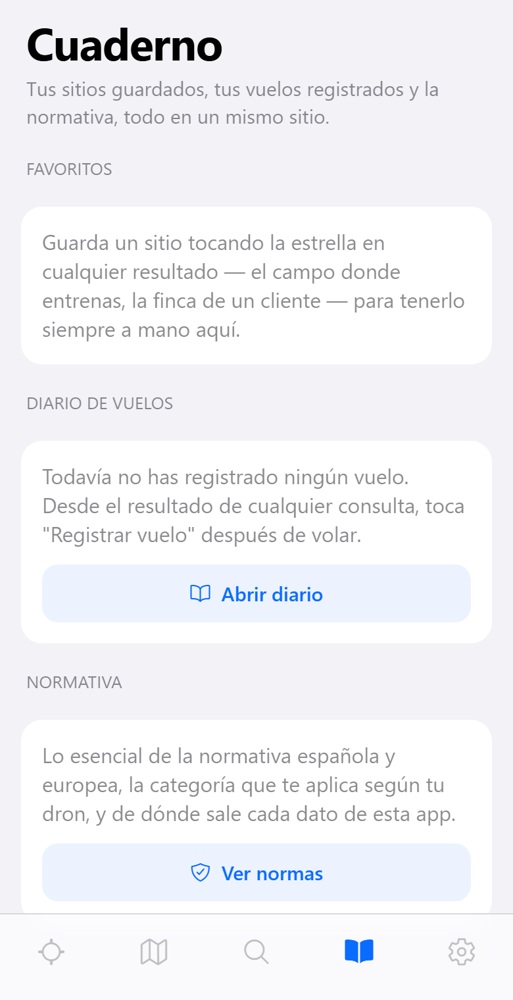</td>
<td width="33%">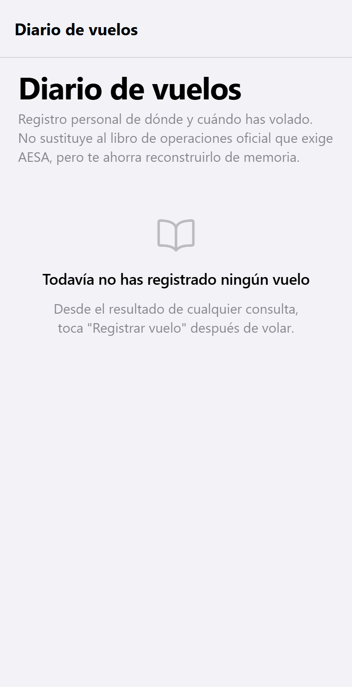</td>
<td width="33%">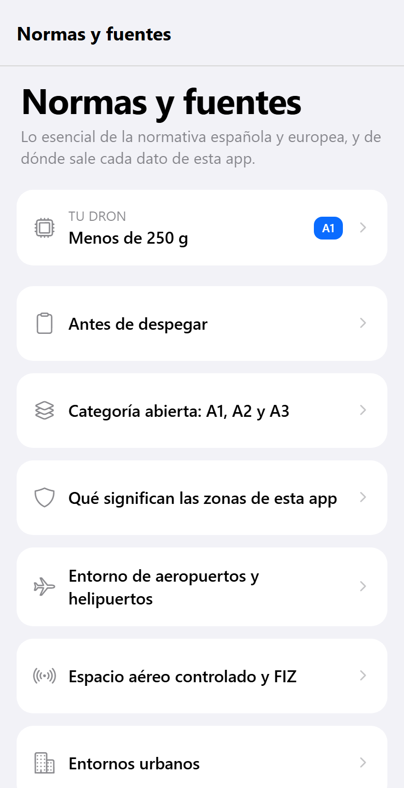</td>
</tr>
</table>

Los sitios guardados se vuelven a consultar al abrirlos: un punto que estaba
libre el mes pasado puede tener hoy una restricción temporal. **Registrar
vuelo**, en cualquier resultado, lo apunta en el diario, que puedes exportar
como texto. Es un registro personal y no sustituye a ningún libro de vuelo
oficial.

**Normas y fuentes** es el resumen de la normativa: qué permite la categoría
abierta, qué cambia según la clase de dron y un enlace a la fuente oficial de
cada afirmación.

### Ajustes

<table>
<tr>
<td width="33%">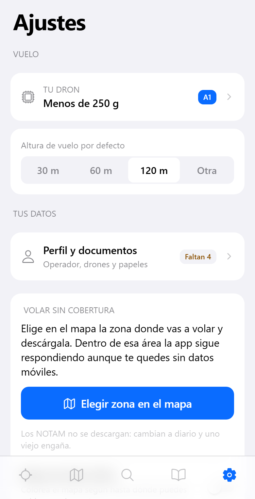</td>
<td width="33%">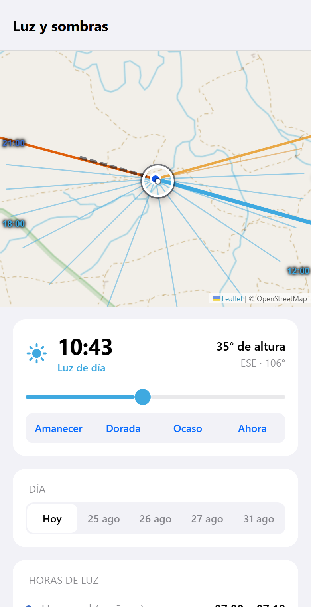</td>
<td width="33%">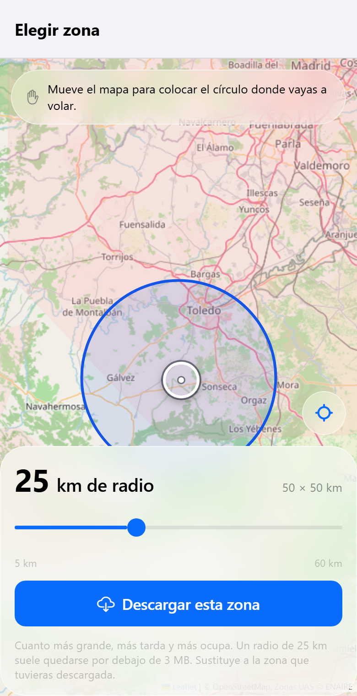</td>
</tr>
</table>

En Ajustes está la altura de vuelo que se usa por defecto, qué dron vuelas
(esto sólo cambia qué normas se te enseñan, nunca el veredicto), el mapa base,
el aspecto claro u oscuro, el **idioma de la interfaz** y tus **datos de
operador**. Esos datos se guardan sólo en el móvil y sirven para rellenar la
solicitud de autorización que envías tú desde tu propia app de correo.

**Luz y sombras** (desde cualquier resultado) da el amanecer, el ocaso, la hora
dorada y la hora azul de ese punto exacto, la dirección y la longitud de las
sombras y —si le pides que mida el terreno— el ocaso real tras las montañas en
vez del teórico.

**Descargar una zona** guarda en el móvil las zonas de ENAIRE y el relieve
alrededor de un punto, para que la app siga respondiendo sin cobertura. Las
respuestas sin conexión se marcan como tales y son tan recientes como el día en
que las descargaste.

### Modo oscuro

Sigue al sistema por defecto, y se puede forzar en Ajustes.

<p align="center">
  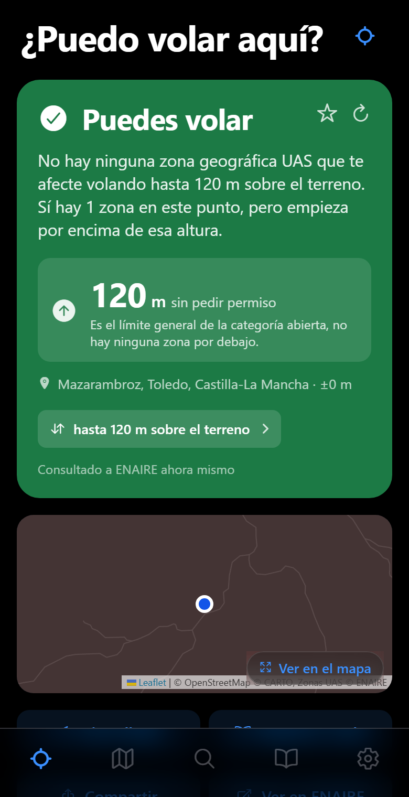
  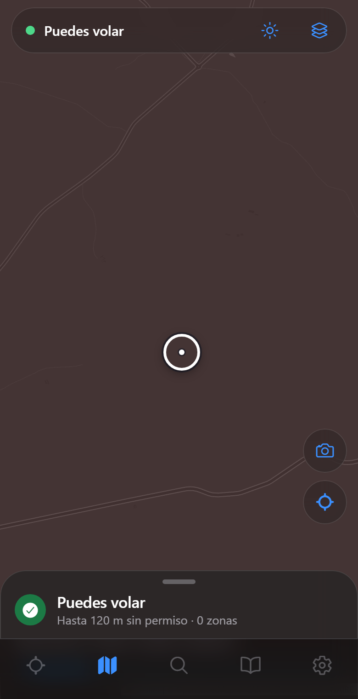
  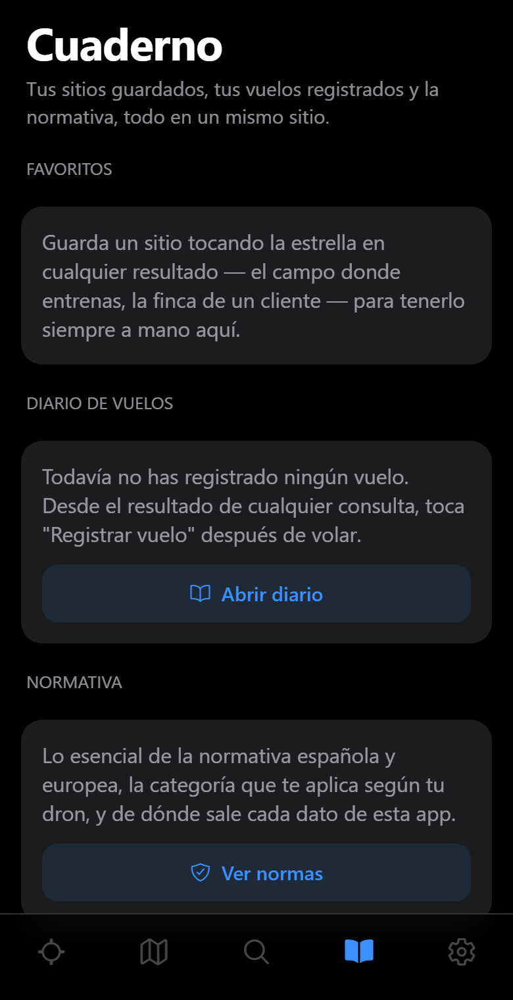
</p>

---

## Qué hace

### Consulta de zonas UAS

- Consulta en tiempo real de las zonas publicadas por ENAIRE.
- Comprobación por ubicación actual, mapa, dirección o coordenadas.
- Cálculo de la altura máxima disponible según las restricciones detectadas.
- Conversión de las referencias de altitud para expresarlas sobre el terreno
  cuando hace falta.
- Restricciones temporales a través de los NOTAM.
- Distancia y rumbo a la zona restringida más cercana.
- Comprobación de entorno urbano para el art. 40 del RD 517/2024, cruzando el
  Catastro con la ocupación del suelo: la pregunta que ENAIRE te deja a ti. Sin
  datos en Navarra y el País Vasco, que tienen catastro propio.
- Espacios naturales protegidos, que ENAIRE no publica.
- Acceso al texto oficial y a los contactos publicados para cada zona.

### Planificación de fotografía

- Trayectoria solar sobre el mapa.
- Amanecer, ocaso, hora dorada y hora azul.
- Dirección y longitud de las sombras.
- Ocaso estimado teniendo en cuenta el relieve.
- Búsqueda de un sitio desde el que fotografiar un objetivo concreto.

### Mapas y utilidades

- Interfaz en español y en inglés, siguiendo al móvil o a mano.
- OpenStreetMap como mapa base.
- Cartografía topográfica y ortofoto del Instituto Geográfico Nacional (IGN).
- Compartir una chincheta desde Google Maps o Apple Maps directamente a la app.
- Historial de consultas, sitios guardados y diario de vuelos personal.
- Compartir resultados.
- Generación de una solicitud de autorización con tus datos de operador.
- Modo sin conexión para consultar zonas descargadas previamente.
- Mapa de altura disponible para encontrar sitios donde volar.
- Tiempo actual y viento de las próximas horas.

---

## Idioma

**Español e inglés**, en Ajustes → Idioma, o siguiendo al móvil. Se traduce todo
lo que escribe la app: las pantallas, las frases del veredicto, el resumen de la
normativa, los perfiles de dron, las fechas y los decimales, y hasta los
topónimos que se le piden a Nominatim.

Lo que se queda en español a propósito: **el texto oficial de las zonas de
ENAIRE, los NOTAM y los nombres de los espacios protegidos**. Se publican sólo
en español, son la norma en sí, y traducir a máquina una restricción legal para
luego decidir sobre ella es justo lo que no debe hacer una app cuyo trabajo es
no equivocarse con las restricciones. La **solicitud de autorización por correo**
también va siempre en español: la lee el gestor de la zona, no tú.

En [`docs/i18n.md`](docs/i18n.md) está el detalle, incluido cómo añadir un
tercer idioma (el documento está en inglés).

---

## Compilarla tú mismo

Sólo hace falta si quieres cambiar la app. Para instalarla, usa las descargas de
arriba.

Requisitos: Node.js 20 o posterior.

```bash
npm install
npm start
```

Después abre el proyecto en un móvil con Expo Go, o bien:

```bash
npm run android
npm run ios
npm run web
```

### APK de Android

En local, con el SDK de Android instalado — más rápido que la nube y sin
necesitar cuenta:

```bash
npm run apk
```

Eso lanza [`scripts/apk.ps1`](scripts/apk.ps1), que le dice a Gradle dónde está
el SDK (`ANDROID_HOME` y `android/local.properties`, que `expo prebuild` se
lleva por delante cada vez), regenera el proyecto nativo si no está, y te dice
dónde ha dejado el `.apk`. Con `npm run apk:debug` sale la variante de
depuración, que necesita `npx expo start --dev-client` levantado para tener
JavaScript.

Un aviso: la plantilla de Expo firma el release con `debug.keystore`, no con la
clave de EAS. El APK compilado en local se instala y funciona, pero no puede
actualizar encima de uno bajado de las releases —hay que desinstalar primero— y
no es el que se publica como actualización.

Para eso sigue estando la compilación en la nube:

```bash
npm install -g eas-cli
eas login
npm run apk:eas
```

### iPhone: el IPA sin firmar

El `.ipa` que se publica en las versiones lo construye
[`.github/workflows/ios.yml`](.github/workflows/ios.yml) en un runner de macOS:
GitHub Actions genera el proyecto nativo, lo archiva con la firma de código
desactivada y comprime el resultado. Se lanza desde **Actions → iOS → Run
workflow** o publicando una etiqueta `vX.Y.Z`; en los dos casos el `.ipa` acaba
adjunto a la release de la versión que diga `package.json`, y esa release se
crea si no existía.

Para esto no se usa EAS: una compilación de iOS que EAS pueda meter en un
dispositivo necesita un perfil de aprovisionamiento, y eso exige una cuenta de
Apple Developer de pago. EAS sí puede compilar una app para el **simulador**,
que no necesita cuenta ninguna:

```bash
eas build --platform ios --profile preview
```

En tu propio Mac, la misma compilación sin firma que hace el workflow:

```bash
npx expo prebuild --platform ios --clean
cd ios && pod install && cd ..
xcodebuild archive \
  -workspace ios/ZonaDron.xcworkspace -scheme ZonaDron \
  -configuration Release -destination 'generic/platform=iOS' \
  -archivePath /tmp/ZonaDron.xcarchive \
  CODE_SIGNING_ALLOWED=NO CODE_SIGNING_REQUIRED=NO CODE_SIGN_IDENTITY=""
mkdir -p /tmp/Payload && cp -R /tmp/ZonaDron.xcarchive/Products/Applications/*.app /tmp/Payload/
cd /tmp && zip -qry ZonaDron-unsigned.ipa Payload
```

O, más sencillo en un Mac: `npx expo run:ios --device`, y que Xcode la firme con
tu Apple ID gratuito.

### Capturas

Las capturas de este archivo se generan desde la compilación web contra los
servicios reales, en claro y en oscuro, con
[`scripts/capturas.mjs`](scripts/capturas.mjs):

```bash
npm i -D playwright && npx playwright install chromium
npm run web:export
npm run capturas es
npm run capturas en
```

---

## Pruebas

Pruebas unitarias deterministas (lógica pura, datos sintéticos, sin red — aptas
para CI):

```bash
npm run test:unit
```

Cubren el motor de decisión (`verdict.ts`, incluido el recálculo de altitud
sobre el punto de referencia del aeródromo), la geometría del modo sin conexión,
las cuentas de sol, sombras y horizonte, y la limpieza de HTML. Con el runner de
pruebas de Node, vía `tsx`.

Comprobación de integración contra el servicio real de ENAIRE (puntos conocidos
—pistas de aeropuerto, centros de ciudad, campo abierto— verificando que el
resultado cambia correctamente con la altura y que una respuesta parcial del
servicio nunca se convierte en un «puedes volar»):

```bash
npm run test:motor
```

Ésta necesita red y puede fallar porque ENAIRE esté caído, no porque el motor
esté mal. Por eso se mantiene separada de `test:unit`.

También hay comprobación de tipos:

```bash
npm run typecheck
```

> **Nota para Windows:** si `test:unit` o `test:motor` fallan al instante con
> `The package "@esbuild/win32-x64" could not be found`, a tu `node_modules` le
> falta la dependencia opcional de Windows (pasa justo después de clonar si el
> último `npm install` se hizo en Linux o WSL). Borra `node_modules` y vuelve a
> ejecutar `npm install` en Windows.

---

## Arquitectura

```text
app/
  (tabs)/
    index.tsx         Pantalla principal y consulta por GPS
    mapa.tsx          Mapa y consulta de zonas
    buscar.tsx        Búsqueda de lugares
    cuaderno.tsx      Sitios guardados, diario y normativa
    ajustes.tsx       Ajustes y datos de operador
  resultado.tsx       Resultado de un punto
  luz.tsx             Luz, sombras y horizonte
  descargar.tsx       Descarga de zonas sin conexión
  diario.tsx          Diario de vuelos
  normas.tsx          Normativa y fuentes

src/
  api/
    enaire.ts         Cliente del servicio de ENAIRE
    elevation.ts      Elevación del terreno
    geocode.ts        Geocodificación
    notam.ts          Restricciones temporales
    protected.ts      Espacios naturales protegidos
    weather.ts        Tiempo y viento
  i18n/
    index.ts          t(), el idioma activo y sus formatos
    es.ts / en.ts     Textos de la interfaz, cuadrados por el compilador
  logic/
    verdict.ts        Motor de decisión
    html.ts           Limpieza del HTML oficial
    labels.ts         Conversión de códigos ED-318
    rules.ts          Información normativa
    reference.ts      Referencias de altitud
  offline/            Paquetes descargados y evaluación sin conexión
  map/
    mapHtml.ts        Integración del mapa
    leafletVendor.ts  Leaflet empaquetado
  components/         Componentes de interfaz
```

## Decisiones técnicas

- Las consultas a ENAIRE se hacen en serie para evitar respuestas incompletas
  del servicio.
- Se piden todos los campos disponibles porque las capas no comparten
  exactamente el mismo esquema.
- El mapa usa Leaflet dentro de un WebView, sin depender de Google Maps ni de
  Apple Maps.
- Leaflet va empaquetado con el proyecto y no depende de ningún CDN en tiempo de
  ejecución.
- Cuando el dato es incompleto o ambiguo, la app se queda con el resultado más
  restrictivo.
- Una respuesta parcial del servicio nunca produce un resultado positivo.
- Las fechas de ENAIRE se interpretan en UTC.

## Fuentes de datos

| Dato | Fuente |
|---|---|
| Zonas Geográficas UAS | [ENAIRE](https://aip.enaire.es/AIP/UAS-es.html) |
| Documentación del servicio | [servAIS API](https://aip.enaire.es/recursos/descargas/ZGUAS/servAIS_APIDOC.pdf) |
| Elevación | [Open-Meteo / Copernicus DEM GLO-90](https://open-meteo.com/en/docs/elevation-api) |
| Suelo urbano o rústico | [Dirección General del Catastro](https://www.sedecatastro.gob.es/) (sin cobertura en Navarra ni el País Vasco) |
| Ocupación del suelo | [SIOSE — IGN](https://www.siose.es/), CC BY 4.0 scne.es |
| Tiempo | [Open-Meteo](https://open-meteo.com/) |
| Geocodificación | [Nominatim / OpenStreetMap](https://nominatim.openstreetmap.org/) |
| Mapas | [OpenStreetMap](https://www.openstreetmap.org/copyright) |
| Cartografía oficial | Instituto Geográfico Nacional (IGN) |
| Normativa | [AESA](https://www.seguridadaerea.gob.es/es/ambitos/drones) |

Ninguna de estas fuentes necesita clave de API.

## Licencia y créditos

El código de la aplicación se publica sin restricciones adicionales.

Créditos:

- Datos de las Zonas Geográficas UAS: © ENAIRE.
- Datos de mapas: © colaboradores de OpenStreetMap, ODbL.
- Leaflet: © Volodymyr Agafonkin y CloudMade, BSD-2-Clause.
