# Zona Dron

**English** · [Español](README.es.md)

[](https://github.com/DKNS-JCC/zonadron/releases/latest)
[](https://github.com/DKNS-JCC/zonadron/releases/latest)

Can I fly my drone here? Zona Dron answers that question for any point in Spain,
using the UAS Geographical Zones published by ENAIRE. Point at a place — with
GPS, on the map, by address or by coordinates — and you get one of five plain
answers:

- You can fly.
- You can fly with conditions.
- Authorization is required.
- You cannot fly.
- The check could not be completed.

Runs on **Android** and **iPhone/iPad**, in **Spanish or English**. No account,
no ads, no tracking, no API keys.

> This application is independent of ENAIRE and does not replace official
> information or applicable regulations. The pilot is responsible for the flight.

<p align="center">
  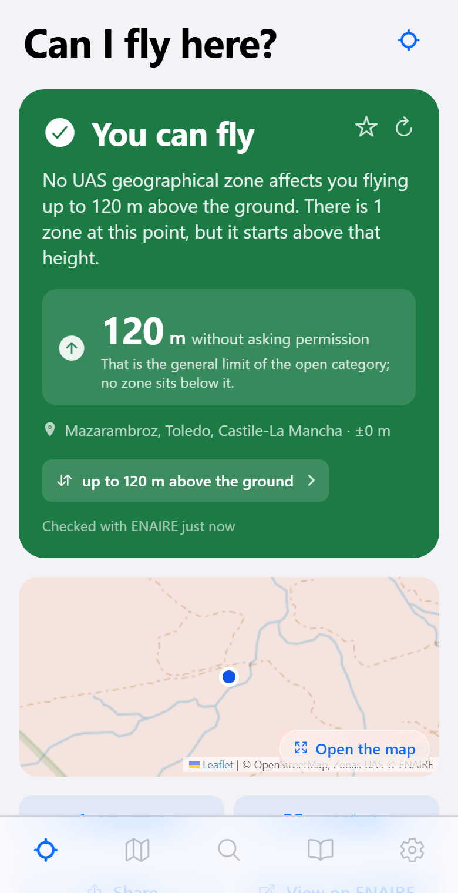
  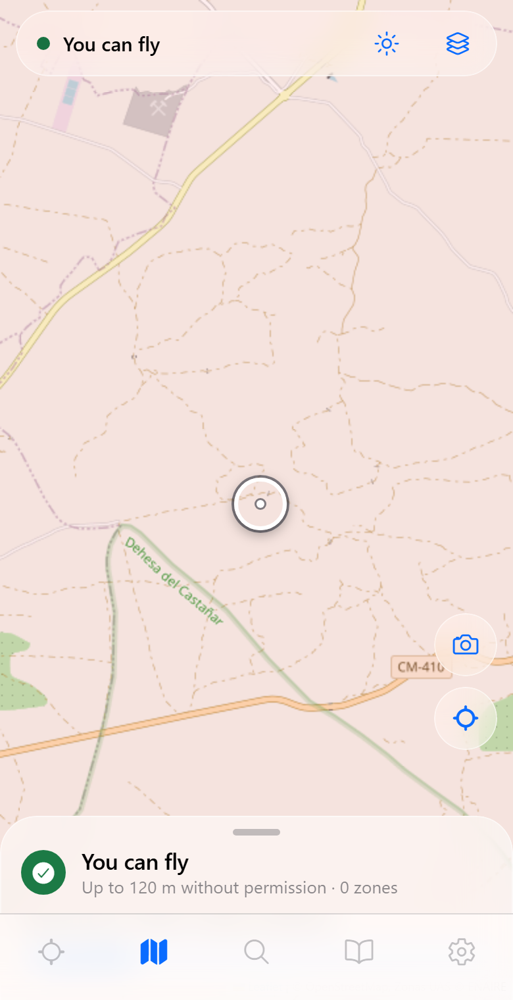
  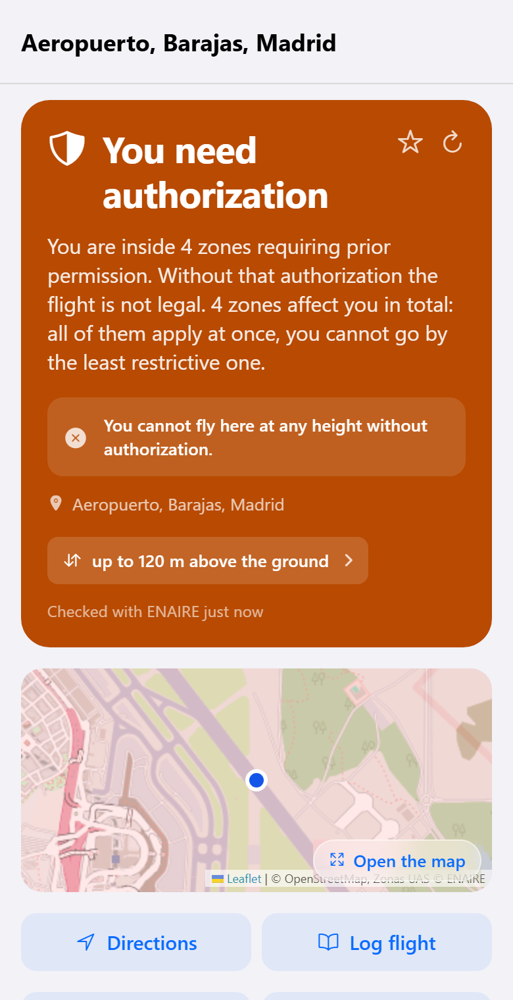
</p>

---

## Install it on your phone

### iPhone or iPad — step by step

Zona Dron is **not on the App Store**: publishing there costs 99 €/year and this
is a free hobby project. Instead, the releases include an **unsigned `.ipa`**
that you install yourself with a free Apple ID. Apple calls this *personal
development signing*, it works on any iPhone, it does not need a jailbreak, and
it does not get your Apple ID banned.

There is one catch, and it is Apple's rule, not ours: **an app signed with a
free Apple ID stops working after 7 days** and has to be re-signed. Method B
below does that renewal for you automatically.

**Before you start, you need:**

- An iPhone or iPad with **iOS 16.4 or later**.
- A Windows PC or a Mac, and the phone's **USB cable**.
- An **Apple ID**. Any one works. If you would rather not type your main Apple
  ID into a third-party tool, [create a second free Apple ID](https://account.apple.com/)
  and use that one — the app will work exactly the same.
- The file `ZonaDron-x.y.z-unsigned.ipa`, from the
  [latest release](https://github.com/DKNS-JCC/zonadron/releases/latest).
  Download it only from that page.

#### Method A — Sideloadly (simplest, do it once)

Best if you just want the app installed now and don't mind repeating five
minutes of work each week.

1. **On Windows only:** install **iTunes from
   [apple.com](https://www.apple.com/itunes/download/)** — *not* the version
   from the Microsoft Store. Sideloadly needs the drivers that come with it.
   On a Mac, skip this step.
2. Download and install **[Sideloadly](https://sideloadly.io/)**.
3. Connect your iPhone to the computer with the cable, unlock the screen, and
   tap **Trust** when the phone asks whether to trust this computer.
4. Open Sideloadly. Your phone should appear at the top under **iDevice**.
5. Drag `ZonaDron-x.y.z-unsigned.ipa` onto the Sideloadly window.
6. Type your Apple ID into the **Apple account** box and press **Start**.
   Sideloadly will ask for your Apple ID password, and then for the six-digit
   code that appears on your iPhone. This is Apple's normal sign-in; the
   password goes to Apple, not to us.
7. Wait for **Done**. Zona Dron now appears on your home screen — but it will
   not open yet.
8. On the iPhone, go to **Settings → General → VPN & Device Management**, tap
   your Apple ID under *Developer App*, and tap **Trust**.
9. Open Zona Dron. When it asks for your location, choose **While Using the
   App** — without it, the "Fly here" tab cannot know where you are.

**Every 7 days** the app will refuse to open. Repeat steps 3–7 (you can install
over the top; your saved places and flight log stay). No need to re-do step 8.

#### Method B — AltStore or SideStore (renews itself)

Best if you want to forget about the 7-day limit.

1. Install **[AltStore Classic](https://altstore.io/)** on your phone by
   following the instructions on their site: you install *AltServer* on your
   Windows PC or Mac, plug the phone in once, and AltServer pairs with it.
2. Open **AltStore** on the phone → **My Apps** → **+** → pick the
   `ZonaDron-x.y.z-unsigned.ipa` file you downloaded.
3. Trust the certificate as in step 8 above, if the phone asks.
4. Leave the computer switched on and on the same Wi-Fi. AltStore re-signs the
   app in the background before the 7 days run out, and the app never stops
   working.

[**SideStore**](https://sidestore.io/) does the same thing without needing the
computer to stay awake, at the cost of a slightly longer setup.

#### Good to know

- A free Apple ID can hold **three** sideloaded apps at a time, and roughly ten
  new app IDs per week. If an install fails with a limit error, remove another
  sideloaded app and try again.
- Zona Dron asks for **one** permission: your location, only while the app is
  open. It has no analytics and no accounts, and the operator details you type
  into Settings never leave the phone.
- If you already have a Mac and Xcode, you can skip all of this and install the
  app directly from source — see [Build it yourself](#build-it-yourself).

### Android

Download the `.apk` from the
[latest release](https://github.com/DKNS-JCC/zonadron/releases/latest) and open
it on the phone. Android will ask for permission to install applications from
external sources; grant it to your browser or file manager and confirm.

---

## Using the app

Five tabs, and everything else hangs off them.

<table>
<tr>
<td width="33%"></td>
<td width="33%"></td>
<td width="33%">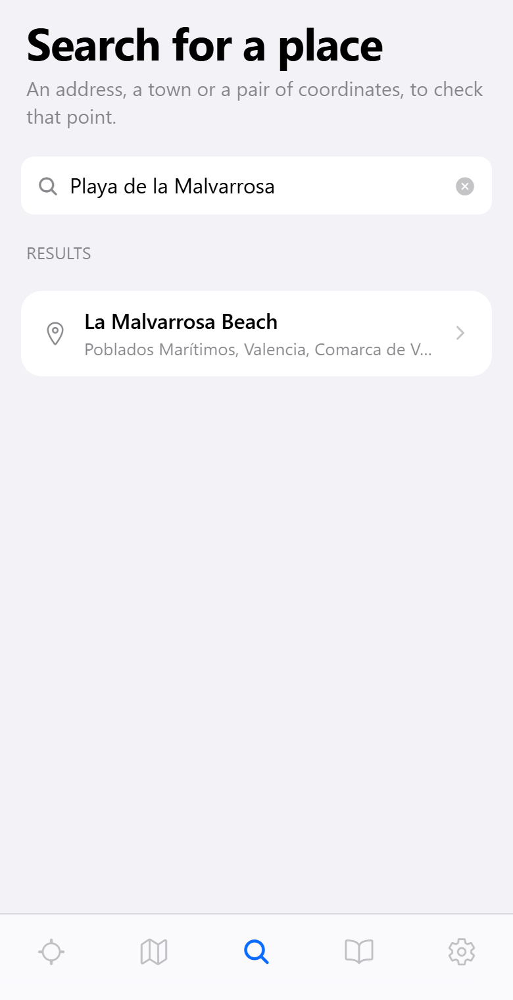</td>
</tr>
<tr>
<td align="center"><b>Fly here</b></td>
<td align="center"><b>Map</b></td>
<td align="center"><b>Search</b></td>
</tr>
</table>

### Fly here

Opens on your GPS position and answers straight away. The coloured card is the
verdict; under it you get the **maximum height you can use without asking
anyone**, the place name, and the height you are checking against.

Tap **up to 120 m above the ground** to change that height: the verdict is
recalculated for the new altitude, because a zone that blocks you at 120 m often
does not exist at 30 m. Everything below the card is optional detail — the mini
map, directions to the point, sharing, the official ENAIRE viewer, the light and
shadow forecast, the zones that affect you, NOTAMs, whether you are standing in
an urban environment, and protected natural areas.

The star saves the place to your notebook; the circular arrow re-queries ENAIRE.

### Map

Drag the map: the crosshair in the middle is what gets checked, and the bar at
the bottom updates with the verdict for whatever is under it. Pull that bar up
for the full result.

- The **layers** button switches between OpenStreetMap, the IGN topographic map
  and PNOA aerial imagery, and turns on the available-height overlay when you
  have downloaded a zone for offline use.
- The **sun** button shows the solar path over the map.
- The **camera** button is the photo planner: say what you want to photograph
  and it suggests points you are allowed to fly from with a view of it.
- The **crosshair** button recentres on you.

### Search

Type an address, a town, a landmark — or paste coordinates like
`39.47, -0.32` — and check a point without going there. Useful the night before.

### Sharing a pin from Maps

Open the spot in **Google Maps** or **Apple Maps**, hit share and pick Zona
Dron: the app opens on that point with the check already running. It reads the
pin's coordinates from the link, following the short `maps.app.goo.gl` form
when that is what Maps hands over.

This needs the installed app — the APK or the IPA — not Expo Go. And on iPhone
it depends on how the app was signed: Apple passes the shared link to the app
through an App Group, and a free Apple ID cannot provision one, so a sideloaded
build may open without receiving the link. If that happens the app says so
instead of failing silently; copy the link and paste it into Search.

### Notebook

Your saved places, your flight log and the rules, in one tab.

<table>
<tr>
<td width="33%">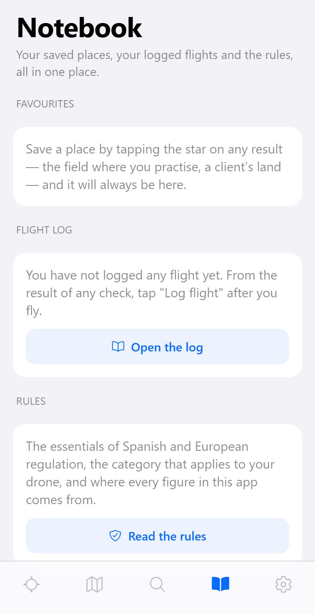</td>
<td width="33%">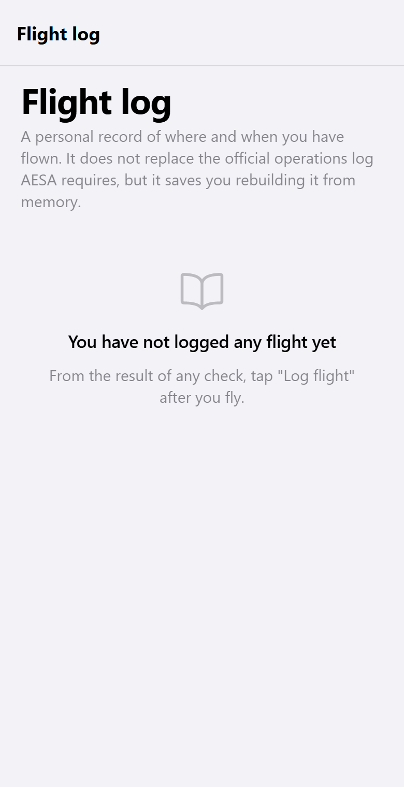</td>
<td width="33%">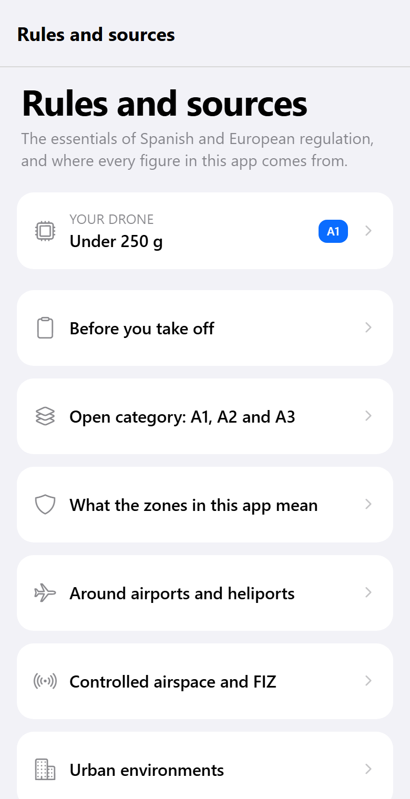</td>
</tr>
</table>

Saved places are re-checked when you open them — a spot that was clear last
month may have a temporary restriction today. **Log flight** on any result adds
it to the flight log, which you can export as plain text. This is a personal
record and does not replace any official logbook.

**Rules and sources** is the regulation summary: what the open category allows,
what each drone class changes, and a link to the official source of every claim.

### Settings

<table>
<tr>
<td width="33%">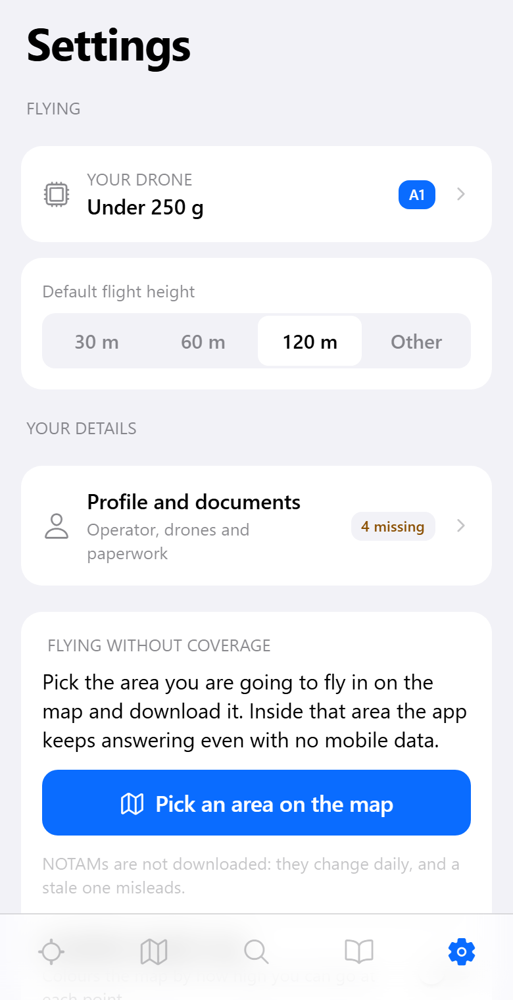</td>
<td width="33%">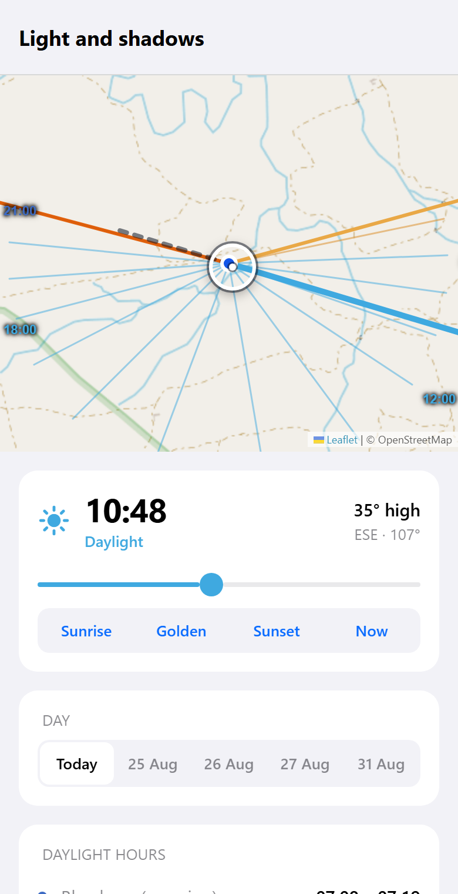</td>
<td width="33%">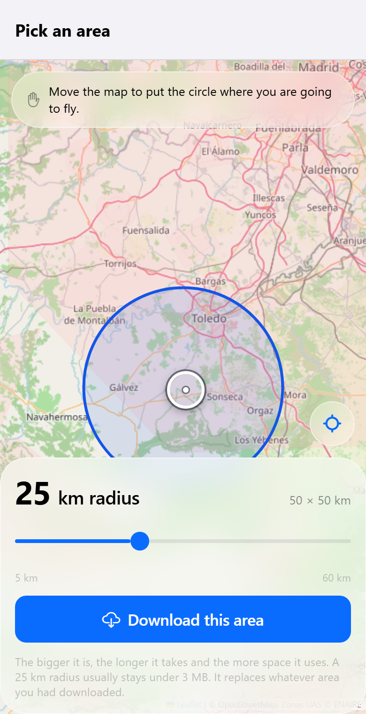</td>
</tr>
</table>

Settings holds the flight height used by default, which drone you fly (this only
changes which rules you are shown — never the verdict), the base map, light or
dark appearance, the **interface language**, and your **operator details**.
Those details are stored only on the phone, and are used to pre-fill the
authorization request that you send from your own mail app.

**Light and shadows** (from any result) gives sunrise, sunset, golden hour and
blue hour for that exact point, the direction and length of shadows, and — if
you ask it to measure the terrain — the real sunset behind the mountains rather
than the theoretical one.

**Download a zone** stores the ENAIRE zones and the terrain around a point on
the phone, so the app keeps answering with no coverage. Offline answers are
marked as such and are only as fresh as the day you downloaded them.

### Dark mode

Follows the system by default, and can be forced either way in Settings.

<p align="center">
  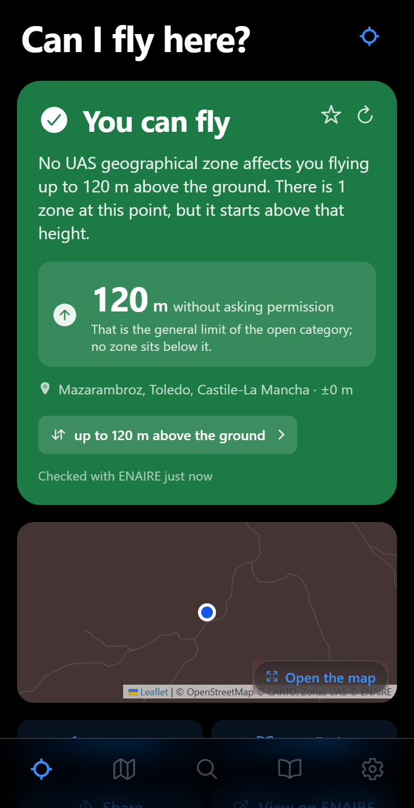
  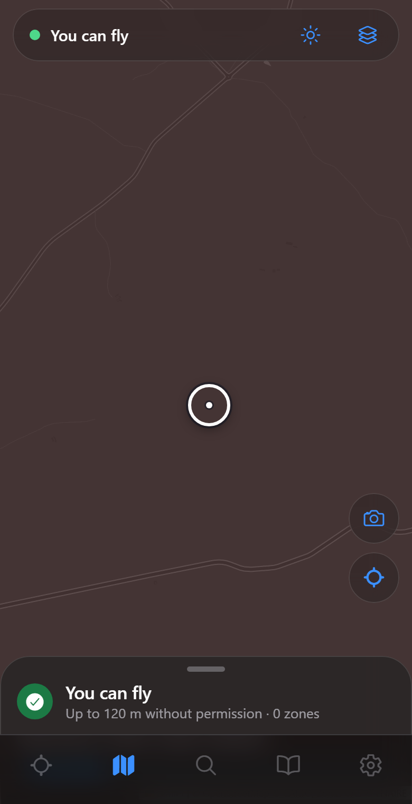
  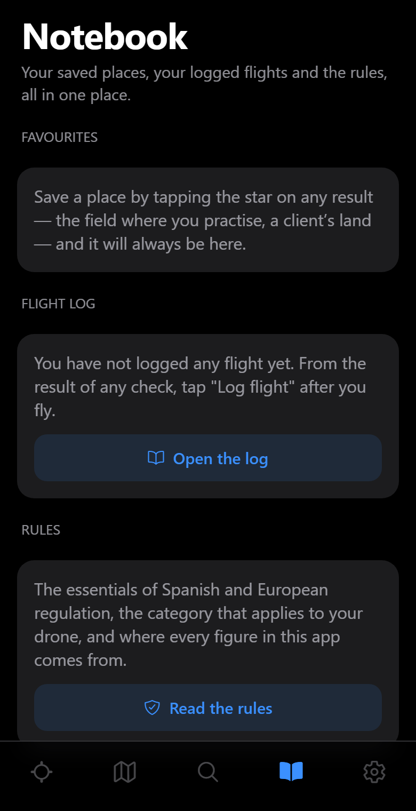
</p>

---

## Features

### UAS zone checks

- Real-time queries of zones published by ENAIRE.
- Checks by current location, map, address, or coordinates.
- Calculation of the maximum available altitude based on detected restrictions.
- Conversion of altitude references to express them relative to the terrain when required.
- Information about temporary restrictions through NOTAMs.
- Distance and bearing to the nearest restricted zone.
- Urban-environment check for article 40 of RD 517/2024, crossing the cadastre
  with the national land cover — the question ENAIRE leaves to you. No data in
  Navarre and the Basque Country, which run their own cadastre.
- Protected natural areas, which ENAIRE does not publish.
- Access to the official text and contact details published for each zone.

### Photography planning

- Solar trajectory displayed on the map.
- Sunrise, sunset, golden hour, and blue hour.
- Shadow direction and length.
- Estimated sunset taking terrain elevation into account.
- Search for a location from which to photograph a specific target.

### Maps and utilities

- Spanish and English interface, following the phone or set by hand.
- OpenStreetMap as the base map.
- Topographic mapping and orthophotography from Spain's National Geographic Institute (IGN).
- Share a pin from Google Maps or Apple Maps straight into the app.
- Query history, saved places and a personal flight log.
- Result sharing.
- Generation of an authorization request using operator data.
- Offline mode for checking previously downloaded zones.
- Available-altitude map for finding suitable areas to fly.
- Current weather and the next hours of wind.

---

## Language

**Spanish and English**, switchable in Settings → Language, or left to follow
the phone. Everything the app writes itself is translated: screens, the verdict
sentences, the regulation summary, the drone profiles, dates and decimals, and
even the place names it asks Nominatim for.

What stays in Spanish, deliberately: **the official ENAIRE zone text, the
NOTAMs, and the names of protected areas**. They are published in Spanish only,
they are the regulation itself, and machine-translating a legal restriction to
then act on it is exactly the wrong move for an app whose whole point is not
being wrong about restrictions. The **authorization request e-mail** also stays
in Spanish whatever the interface language is — it is read by a Spanish zone
manager, not by you.

[`docs/i18n.md`](docs/i18n.md) has the details, including how to add a third
language.

---

## Build it yourself

Only needed if you want to change the app. To just install it, use the releases
above.

Requirements: Node.js 20 or later.

```bash
npm install
npm start
```

Then open the project on a device with Expo Go, or:

```bash
npm run android
npm run ios
npm run web
```

### Android APK

The project uses Expo Application Services (EAS):

```bash
npm install -g eas-cli
eas login
npm run apk
```

### iPhone: the unsigned IPA

The `.ipa` published in the releases is built by
[`.github/workflows/ios.yml`](.github/workflows/ios.yml) on a macOS runner:
GitHub Actions generates the native project, archives it with code signing
turned off, and zips the result. Run it from the repository's **Actions → iOS →
Run workflow**, or push a `vX.Y.Z` tag. Either way the finished `.ipa` is
attached to the release for the version in `package.json`, and that release is
created if it does not exist yet.

EAS is not used for this: an iOS build that EAS can put on a device needs a
provisioning profile, and that needs a paid Apple Developer account. EAS can
still build a **simulator** app, which needs no account at all:

```bash
eas build --platform ios --profile preview
```

On your own Mac, the same unsigned build as the workflow:

```bash
npx expo prebuild --platform ios --clean
cd ios && pod install && cd ..
xcodebuild archive \
  -workspace ios/ZonaDron.xcworkspace -scheme ZonaDron \
  -configuration Release -destination 'generic/platform=iOS' \
  -archivePath /tmp/ZonaDron.xcarchive \
  CODE_SIGNING_ALLOWED=NO CODE_SIGNING_REQUIRED=NO CODE_SIGN_IDENTITY=""
mkdir -p /tmp/Payload && cp -R /tmp/ZonaDron.xcarchive/Products/Applications/*.app /tmp/Payload/
cd /tmp && zip -qry ZonaDron-unsigned.ipa Payload
```

Or, simpler on a Mac: `npx expo run:ios --device`, and let Xcode sign it with
your free Apple ID.

### Screenshots

The screenshots in this file are generated from the web build against the real
services, in light and dark, with
[`scripts/capturas.mjs`](scripts/capturas.mjs):

```bash
npm i -D playwright && npx playwright install chromium
npm run web:export
npm run capturas es
npm run capturas en
```

---

## Testing

Deterministic unit tests (pure logic, synthetic fixtures, no network — safe for CI):

```bash
npm run test:unit
```

Covers the decision engine (`verdict.ts`, including the aerodrome-reference-point
altitude recalculation), offline-mode geometry, the sun/shadow/horizon math, and
HTML sanitization. Node's built-in test runner, via `tsx`.

Live integration check against the real ENAIRE service (known locations —
airport runways, city centers, open countryside — verifying the result changes
correctly with altitude and that a partial service response never turns into a
"you can fly"):

```bash
npm run test:motor
```

This one needs network and can fail because ENAIRE is down, not because the
engine is wrong — that's why it's kept separate from `test:unit`.

Type checking is also available:

```bash
npm run typecheck
```

> **Windows note:** if `test:unit` or `test:motor` fail immediately with
> `The package "@esbuild/win32-x64" could not be found`, your `node_modules`
> is missing the Windows-specific optional dependency (common right after
> cloning if `npm install` last ran on Linux/WSL). Delete `node_modules` and
> run `npm install` again on Windows to fix it.

---

## Architecture

```text
app/
  (tabs)/
    index.tsx         Main screen and GPS query
    mapa.tsx          Map and zone queries
    buscar.tsx        Location search
    cuaderno.tsx      Saved places, flight log and rules
    ajustes.tsx       Settings and operator details
  resultado.tsx       Result for a location
  luz.tsx             Light, shadows and horizon
  descargar.tsx       Offline zone download
  diario.tsx          Flight log
  normas.tsx          Regulations and sources

src/
  api/
    enaire.ts         ENAIRE service client
    elevation.ts      Elevation lookup
    geocode.ts        Geocoding
    notam.ts          Temporary restrictions
    protected.ts      Protected natural areas
    weather.ts        Weather and wind
  i18n/
    index.ts          t(), the active locale and its formats
    es.ts / en.ts     Interface strings, kept in step by the compiler
  logic/
    verdict.ts        Decision engine
    html.ts           Official HTML cleanup
    labels.ts         ED-318 code conversion
    rules.ts          Regulatory information
    reference.ts      Altitude reference handling
  offline/            Downloaded packs and offline evaluation
  map/
    mapHtml.ts        Map integration
    leafletVendor.ts  Bundled Leaflet
  components/         UI components
```

## Technical decisions

- ENAIRE queries are performed sequentially to avoid incomplete service responses.
- All available fields are requested because the layers do not share exactly the same schema.
- The map uses Leaflet inside a WebView, avoiding dependencies on Google Maps or Apple Maps.
- Leaflet is bundled with the project and does not depend on a CDN at runtime.
- When data is incomplete or ambiguous, the application uses the most restrictive result.
- A partial service response never produces a positive result.
- ENAIRE dates are interpreted in UTC.

## Data sources

| Data | Source |
|---|---|
| UAS Geographical Zones | [ENAIRE](https://aip.enaire.es/AIP/UAS-es.html) |
| Service documentation | [servAIS API](https://aip.enaire.es/recursos/descargas/ZGUAS/servAIS_APIDOC.pdf) |
| Elevation | [Open-Meteo / Copernicus DEM GLO-90](https://open-meteo.com/en/docs/elevation-api) |
| Urban / rustic land | [Dirección General del Catastro](https://www.sedecatastro.gob.es/) (no coverage in Navarre or the Basque Country) |
| Land cover | [SIOSE — IGN](https://www.siose.es/), CC BY 4.0 scne.es |
| Weather | [Open-Meteo](https://open-meteo.com/) |
| Geocoding | [Nominatim / OpenStreetMap](https://nominatim.openstreetmap.org/) |
| Maps | [OpenStreetMap](https://www.openstreetmap.org/copyright) |
| Official cartography | National Geographic Institute (IGN) |
| Regulations | [AESA](https://www.seguridadaerea.gob.es/es/ambitos/drones) |

No API key is required for these sources.

## License and credits

The application code is published without additional restrictions.

Credits:

- UAS Geographical Zone data: © ENAIRE.
- Map data: © OpenStreetMap contributors, ODbL.
- Leaflet: © Volodymyr Agafonkin and CloudMade, BSD-2-Clause.
